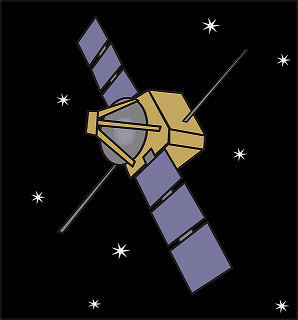

# REST API for Mercado Libre's Technical Challenge

<p align="center">
  
</p>

In February of 2022, I developed a Java web app as part of a technical test for the E-commerce company Mercado Libre. The coding challenge consisted of building one REST API with Java and then hosting the resulting program on a cloud computing platform (I chose Amazon Web Services for the job, at the time). 

The program's primary purpose is to intercept the location and the message of a spaceship in distress through satellite communication. There are three satellites besides the ship and we know the X and Y coordinates of each one (the relevant area of space is represented by a cartesian plane), we just have to input our estimates of the distance between each one of the satellites and the spaceship, as well as the help message received by each satellite (which is just a fragment of the actual message sent by the ship). Then if possible with the data entered, the program will determine both the location and the complete message of the endangered ship.

## How to Use

We need a tool like [Postman](https://www.postman.com/) to generate HTTP requests to the URL of the site in which the app is currently being hosted:

[redacted] (a link is no longer available due to the hosting service having been suspended since 2022, so the app only works when being hosted offline for the time being. Check the bottom of this page to know what server I used for that.) 

In order to input the required data for the program to function, we have to send a POST request to [redacted]/api/topsecret with the following info in JSON format on the request's body:


```
[
       {
            "name": "kenobi",
            "distanceFromShip": 0.0,
            "receivedMessage": ["", "", "", "", ""]
       },
       {
            "name": "skywalker",
            "distanceFromShip": 0.0,
            "receivedMessage": ["", "", "", "", ""]
       },
       {
            "name": "sato",
            "distanceFromShip": 0.0,
            "receivedMessage": ["", "", "", "", ""]
       }
]
```

Afterwards without modifying the name fields at all, we change the values of the fields corresponding to the estimated distance between the satellites and the spaceship with other real numbers of our choosing, and on the fields below with the empty quotes we add the words of the message as obtained by each one of the satellites, like in this example:

```
[
       {
            "name": "kenobi",
            "distanceFromShip": 663.4,
            "receivedMessage": ["this", "", "", "secret", ""]
       },
       {
            "name": "skywalker",
            "distanceFromShip": 264.7,
            "receivedMessage": ["", "is", "", "", "message"]
       },
       {
            "name": "sato",
            "distanceFromShip": 447.7,
            "receivedMessage": ["this", "", "a", "", ""]
       }
]
```

If the POST request is then sent without any issues, you should get a result similar to this one (which is what you'll get after inputting the data of the above example) with the location of the spaceship and the full message emitted by it:

```
x: 56.5
y: 161.1
message: this is a secret message 
```

It's also possible to enter the calculated distance from the ship and the collected message of a particular satellite by sending a POST request to [redacted]/api/topsecret_split/satellitename, replacing "satellitename" at the end of the URL with the name of the satellite you want to add the data to (which can only be kenobi, skywalker or sato as those three are the only names available). Then the request body must be in JSON format and with the following structure:

```
{
       "distanceFromShip": 0.0,
       "receivedMessage": ["", "", "", "", ""]
}
```

After filling in the necessary data for each satellite with this method, you have to send a GET request to [redacted]/api/topsecret_split to obtain the final result. 

## Tools Used for Coding and Testing

- Apache NetBeans IDE 12.6 (to create, edit and test the Maven web app project)
- Java Development Kit 8
- Java EE Web API 7
- Oracle GlassFish Server 5 (to host the app offline for testing)
- The Postman API Platform
- Geogebra Calculator Suite (to verify the accuracy of the trilateration algorithm)

## Cloud Hosting Platform

The application environment is being managed with the AWS Elastic Beanstalk orchestration service, and the app is deployed through a Preconfigured Docker container (GlassFish 5.0 with Java 8 running on 64bit Amazon Linux).
